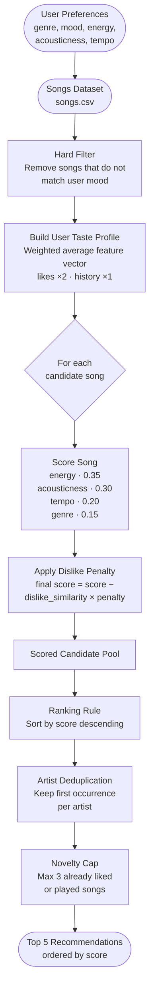

```mermaid
flowchart TD
    A([User Preferences\ngenre, mood, energy,\nacousticness, tempo]) --> B
    B([Songs Dataset\nsongs.csv]) --> C

    C[Hard Filter\nRemove songs that do not\nmatch user mood] --> D

    D[Build User Taste Profile\nWeighted average feature vector\nlikes ×2 · history ×1] --> E

    E{For each\ncandidate song} --> F

    F[Score Song\nenergy · 0.35\nacousticness · 0.30\ntempo · 0.20\ngenre · 0.15] --> G

    G[Apply Dislike Penalty\nfinal score = score −\ndislike_similarity × penalty] --> H

    H[Scored Candidate Pool] --> I

    I[Ranking Rule\nSort by score descending] --> J

    J[Artist Deduplication\nKeep first occurrence\nper artist] --> K

    K[Novelty Cap\nMax 3 already liked\nor played songs] --> L

    L([Top 5 Recommendations\nordered by score])
```
